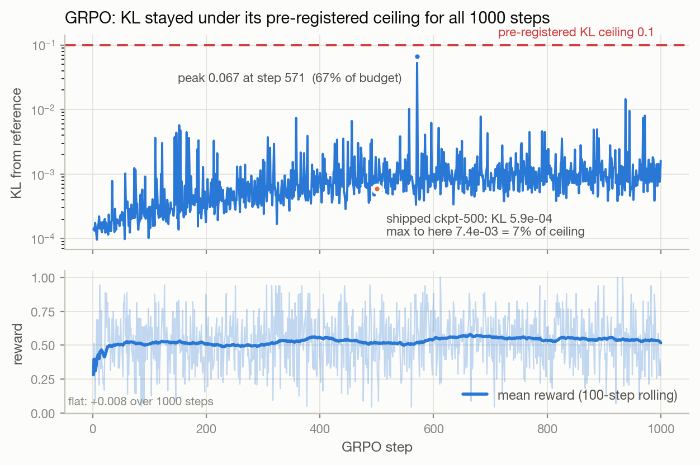
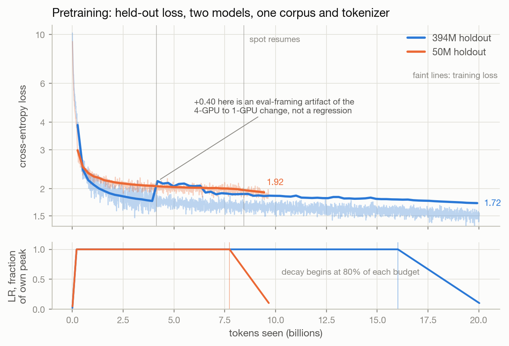

<picture>
  <source media="(prefers-color-scheme: dark)" srcset="assets/banner-dark.svg">
  
</picture>

<p align="center">
  <a href="https://github.com/shivenkk/sqlpup/actions/workflows/ci.yml"></a>
  
  <a href="https://pytorch.org/docs/stable/notes/ddp.html"></a>
  <a href="results/"></a>
  <a href="tests/"></a>
  <a href="LICENSE"></a>
</p>

A 394M-parameter text-to-SQL language model where **every stage is built from
scratch for this one task**: the corpus, the tokenizer, the model, the training
loop, the spot-instance harness, and the evaluation sandbox. No industrial base
model, no fine-tune shortcut, on a three-digit AWS budget.

The interesting output is not the score. It is the **measured price of not having
industrial pretraining data**, taken against a control that differs in exactly
that one respect.

## Results

[BIRD](https://bird-bench.github.io/) **dev**, 1,534 questions, official
execution-accuracy semantics. `±` is the standard deviation over three sampling
seeds (0/101/202), not a standard error.
Every number is read off a committed artifact in [`results/`](results/).

| model | pretraining | unaided greedy | greedy + compaction | k=7 + compaction |
|---|---|---:|---:|---:|
| sqlpup 394M (SFT) | 9.67B tokens, from scratch | 17.41% | 17.86% | 22.84 ± 0.14 |
| sqlpup 394M (SFT + GRPO) | 9.67B tokens, from scratch | 18.12% | **19.23%** | **23.51 ± 0.38** |
| Qwen2.5-0.5B (SFT), control | ~18T tokens, industrial | 23.27% | 25.42% | 31.49 ± 0.91 |
| **clean SFT-vs-SFT gap** | | **5.87pt** | **7.56pt** | **8.65pt** |

Columns are decoding configurations and **only cells within one column are
comparable.** The pretraining comparison lives entirely in the two SFT rows: the
GRPO arm carries a reinforcement-learning step the control never received, so it
belongs to the post-training discussion and never to a pretraining claim.

The control gets the identical SFT recipe, harness, inference stack, and prompt
budget. Compaction fires on the same 129 of 1,534 over-context prompts for every
arm, which is how the capacity match is verified.

**On size.** The control carries 494.0M parameters against our 394.3M, 25% more,
but that gap is almost entirely vocabulary: 151,936 tokens against our 32,768,
which is 136.1M embedding parameters against 33.6M. The transformer bodies match
to within 1%, **357.9M against 360.8M non-embedding**, so the compute-bearing
parameters are level and what remains between the two arms is pretraining data.
Both counts are derived from the shipped bf16 checkpoints and their configs.

### Test-time scaling opens the gap, it does not close it

Roughly 1,861x more pretraining data ([Qwen2.5
report](https://arxiv.org/abs/2412.15115)) is worth 5.87pt at greedy decoding,
and that gap widens monotonically as the inference stack gets richer: **5.87 to
7.56 to 8.65pt**. At the widest point the separation is 9.4 combined standard
deviations. Better inference helps the industrially pretrained model *more*.

The mechanism is visible directly. Compaction rescues the *same* 129 prompts in
every arm, so the only variable is how many get converted into correct answers,
and that count tracks model strength exactly:

| arm | unaided greedy | converts of 129 | compaction worth |
|---|---:|---:|---:|
| sqlpup SFT | 17.41% | 7 | +0.46pt |
| sqlpup + GRPO | 18.12% | 17 | +1.11pt |
| Qwen2.5-0.5B | 23.27% | 33 | +2.15pt |

A stronger model holds more reachable-but-unranked answers, so any mechanism
granting it one more attempt pays it more. The same ordering appears in voting
gains and in seed sensitivity (0.14, 0.38, 0.91 across the three arms):
self-consistency converts reachable answers into accuracy *and* into
instability.

### RL holds in one configuration of three

Execution-feedback GRPO was measured against its own SFT baseline in all three
configurations. It reaches significance in one:

| configuration | SFT | + GRPO | gain | paired test |
|---|---:|---:|---:|---|
| unaided greedy | 17.41% | 18.12% | +0.72pt | McNemar p = 0.080, **not significant** |
| greedy + compaction | 17.86% | 19.23% | +1.37pt | McNemar p = 0.0019 |
| k=7 + compaction | 22.84 ± 0.14 | 23.51 ± 0.38 | +0.67pt | McNemar p = 0.289, ~2 sd |

**The RL gain is configuration-dependent and reported as such.** Half of the
compacted advantage is a compaction interaction: of GRPO's 21-example lead in
that column, 11 are present at unaided greedy too, and the other 10 come from
GRPO converting compaction-rescued prompts better than SFT does. Add voting and
the advantage largely disappears, because voting already harvests most of what
RL learned to rank first.

So RL and the two inference levers pull in opposite directions. Compaction is
**synergistic** with it, self-consistency is **antagonistic** to it, and on its
own it does not clear significance on 1,534 questions.

<picture>
  <source media="(prefers-color-scheme: dark)" srcset="assets/grpo-kl-dark.png">
  
</picture>

The halt conditions were declared before the run, so the KL trace is the
evidence they held rather than an assertion that they did. It never breached the
0.1 ceiling, though it reached 67% of it at step 571; the shipped ckpt-500 sits
at 5.9e-4, having used 7% of the budget to that point. Mean reward is flat
across the whole run, **+0.008 from first hundred steps to last**, which is why
the reward curve is not offered as evidence of learning: the blended reward
mixes exact matches with grounding bonuses and cannot separate a sharpening
policy from one farming the bonus.

## The numbers

| | |
|---|---|
| **Parameters** | 394,331,136 (360.8M non-embedding + 33.6M tied embedding) |
| **Architecture** | Llama-3-style decoder · d_model 1024 × **32 layers** · GQA 16q/4kv · SwiGLU · RoPE · RMSNorm |
| **Tokenizer** | 32,768-vocab byte-level BPE, code-tuned pre-tokenizer ([fertility report](docs/tokenizer-fertility.md)) |
| **Corpus** | 9.67B tokens / 5.41M documents · 5 sources · exact + near dedup · 13-gram decontamination |
| **Pretraining** | ~20B tokens seen (2 epochs) · 1,048,576 tokens/step · WSD, peak LR 3e-4 · DDP |
| **Post-training** | SFT on filtered NL-to-SQL pairs, then GRPO over an execution reward |
| **Hardware** | 4x L40S spot with a single-GPU tail · self-healing harness, exact-resume checkpoints |
| **Quality gates** | 533 tests, 497 of them on a bare CI checkout (36 need the shipped tokenizer or the `rl` extra) · mypy strict · ruff · CI on every push |

<picture>
  <source media="(prefers-color-scheme: dark)" srcset="assets/pretrain-loss-dark.png">
  
</picture>

Both models share the corpus, the tokenizer, and 1,048,576 tokens per step, so
the x-axis is directly comparable. Peak learning rates differ (3e-4 and 2e-3),
so the lower panel shows each schedule as a fraction of its own peak. The step
at 4B tokens is an evaluation-framing artifact of the 4-GPU to 1-GPU change,
annotated rather than corrected because the logged values stay as measured.

## Pipeline

```mermaid
flowchart LR
  subgraph D["data"]
    direction TB
    A["5 raw sources"] --> B["clean + filter"]
    B --> C["exact + MinHash dedup"]
    C --> E["13-gram decontamination"]
    E --> F["uint16 shards + holdout"]
  end
  subgraph K["tokenizer"]
    K1["32k byte-level BPE<br/>code pre-tokenizer"]
  end
  subgraph P["training"]
    direction TB
    P1["394M pretrain<br/>WSD, spot DDP"] --> P2["export to HF layout"]
    P2 --> P3["SFT on NL-to-SQL pairs"]
    P3 --> P4["GRPO on execution reward"]
  end
  subgraph V["evaluation"]
    direction TB
    V2["generate<br/>compaction, k=7 voting"] --> V3["score<br/>sandboxed execution"]
    V3 --> V4["diagnose<br/>verdict panel"]
    V1["gold-check"]
  end
  B -.trains.-> K1
  K1 -.tokenizes.-> F
  F --> P1
  P4 --> V2
  V1 -.certifies.-> V3

  classDef cData fill:#e0e7ff,stroke:#4f46e5,color:#1e1b4b
  classDef cTok fill:#cffafe,stroke:#0891b2,color:#083344
  classDef cTrain fill:#fee2e2,stroke:#dc2626,color:#450a0a
  classDef cEval fill:#dcfce7,stroke:#16a34a,color:#052e16
  class A,B,C,E,F cData
  class K1 cTok
  class P1,P2,P3,P4 cTrain
  class V1,V2,V3,V4 cEval
```



## Why these choices

- **Depth over width.** The 400M model is a pure depth scale-up of the 260M
  baseline (identical 1024-wide layers, 20 to 32 of them): a stronger
  compositional bias for SQL at this scale, and every convention carries over
  1:1. The parameter count is verified in tests by constructing the model on a
  meta device.
- **A task-shaped tokenizer.** The 32k byte-level BPE uses a cl100k-style code
  pre-tokenizer trained on a SQL-heavy mix. At **matched vocabulary** it
  out-compresses GPT-4's cl100k on every SQL surface measured (BIRD and
  [Spider](https://yale-lily.github.io/spider) questions, schemas, and
  queries). The shipped 32k
  is **3-6x smaller** than the reference vocabularies, stays within a modest
  margin of them, and beats Qwen2.5 on StarCoder SQL. Numbers and caveats:
  [docs/tokenizer-fertility.md](docs/tokenizer-fertility.md).
- **Dedup that fits in RAM.** Near-dedup confirms MinHash-LSH candidates by
  signature agreement instead of retaining full shingle sets: ~1 KiB of state
  per kept document, the difference between 22 GiB and a physically impossible
  ~450 GiB over the merged corpus.
- **Spot-native training.** Checkpoints stream to object storage with atomic
  writes and exact resume (model, optimizer, data cursor, RNG). RNG restore is
  world-size-portable, so a 4-GPU checkpoint continues on 1 GPU. The
  warmup-stable-decay schedule keeps the token budget extendable mid-run. Spot
  reclaims are a recoverable event, not an incident.
- **A harness that certifies itself.** Every gold query is executed against its
  own database before any model is scored, so harness faults and model faults
  can never be confused. Predictions execute in a separate process under
  `PRAGMA query_only` and a SQLite authorizer that denies writes, `ATTACH`, and
  `DETACH`, with distinct-row and wall-clock caps so a runaway query cannot
  exhaust memory or hang the run.

## Data mix

| source | approx tokens | share | license |
|---|---:|---:|---|
| [FineWeb-Edu](https://huggingface.co/datasets/HuggingFaceFW/fineweb-edu) | 4.0B | 41% | ODC-By-1.0 |
| [StarCoder SQL](https://huggingface.co/datasets/bigcode/starcoderdata) | 2.5B | 26% | BigCode OpenRAIL-M |
| [SynSQL-2.5M](https://huggingface.co/datasets/seeklhy/SynSQL-2.5M) | 1.5B | 16% | Apache-2.0 |
| [The Stack (Python)](https://huggingface.co/datasets/bigcode/the-stack-dedup) | 1.0B | 10% | permissive-only filter |
| [SchemaPile](https://zenodo.org/records/12682521) | 14M | <1% | CC-BY-4.0 |

After cleaning, deduplication (47.9K exact + 30.1K near duplicates dropped) and
decontamination (260 documents overlapping eval sets removed): **5,412,213
documents, 9.67B train tokens + 199M held-out tokens**, packed into uint16
shards.

## Limitations

- The BIRD number is a **dev-split** result. No test-split submission is claimed.
- Self-consistency is deterministic given a seed, so error bars come from varying
  the seed explicitly. They do not appear by re-running.
- Two of the 1,534 dev gold queries exceed the official 30s budget on the Apple
  M-series laptop that runs the harness certificate, taking about 36s and 170s.
  They are reported as `gold_error`, never silently dropped, and cap achievable EX
  at 99.87% on that host.
- The RL gain clears significance in one decoding configuration of three, and is
  reported that way rather than as a single headline number.
- The GRPO arm is never compared to the control as a pretraining result. At
  matched decoding it trails by 6.19pt (19.23 vs 25.42), but it received an RL
  step the control did not.
- The SFT baselines come from three successive harness versions, so both RL
  comparisons cross a version boundary. Flags were identical within each pair.
  This is a known source of noise in the RL deltas, not in the pretraining
  comparison, where each column ran on one harness.

## Quickstart

Requires [uv](https://docs.astral.sh/uv/) and Python 3.12+.

```bash
uv sync --dev && make check    # ruff + mypy (strict) + pytest
```

Every stage is a CLI subcommand that reads and writes JSONL(.zst) and prints a
one-line JSON summary. Every stage is also a make target.

```bash
# 1. Build the corpus: stream, clean, dedup, decontaminate, shard.
uv run sqlpup data download --config configs/data/mix_baseline.yaml --source synsql
uv run sqlpup data clean --in data/raw/synsql.jsonl.zst --out data/clean/synsql.jsonl.zst
uv run sqlpup data dedup --in data/clean/synsql.jsonl.zst --out data/dedup/synsql.jsonl.zst --near
uv run sqlpup data build-eval-index
uv run sqlpup data decontaminate --in data/dedup/synsql.jsonl.zst \
    --out data/final/synsql.jsonl.zst --index-in artifacts/decontam/eval_index.json
uv run sqlpup data shard --in data/final/synsql.jsonl.zst \
    --tokenizer artifacts/tokenizer/tokenizer.json \
    --out-dir artifacts/shards/train --holdout-out-dir artifacts/shards/eval --holdout-mod 50

# 2. Pretrain. --resume auto continues from <out_dir>/latest.json when present.
uv run sqlpup train --config configs/train/base_400m.yaml --resume auto

# 3. Export to a HuggingFace layout, then fine-tune.
uv run sqlpup export --checkpoint artifacts/checkpoints/base_400m/latest.pt --out-dir artifacts/hf/base_400m
uv run sqlpup sft prepare --data train.json --db-root databases/ \
    --tokenizer artifacts/tokenizer/tokenizer.json --out artifacts/sft/pairs.jsonl
uv run sqlpup sft train --model-dir artifacts/hf/base_400m --pairs artifacts/sft/pairs.jsonl \
    --tokenizer artifacts/tokenizer/tokenizer.json --out-dir artifacts/sft/run

# 4. Optionally continue with GRPO over the execution reward.
uv run sqlpup rl grpo --model-dir artifacts/sft/run --data train.json --db-root databases/ \
    --tokenizer artifacts/tokenizer/tokenizer.json --out-dir artifacts/rl/run

# 5. Evaluate. gold-check certifies the harness before any model is scored.
uv run sqlpup eval gold-check --subset dev
uv run sqlpup eval generate --model-dir artifacts/rl/run --subset dev \
    --self-consistency 7 --compact-overflow --seed 0 --out preds.json
uv run sqlpup eval score --predictions preds.json --subset dev --out score.json
```

`make smoke-train` runs a seconds-long CPU check of the train, checkpoint, and
resume path. `make tokenizer-corpus tokenizer-train` rebuilds the shipped
tokenizer end to end, and `make fertility` regenerates its report.

Optional extras keep non-dev installs lean: `--extra train` (torch), `--extra
aws` (S3 checkpoint mirroring), `--extra report` (reference tokenizers),
`--extra track` (Weights & Biases).

## Repository layout

```
src/sqlpup/
  cli.py        command-line entry point: one subcommand per pipeline stage
  config.py     dataclass configs + YAML loaders
  io.py         Document type and JSONL(.zst) reading/writing
  shard.py      pack tokenized documents into uint16 shards
  data/         download, render, clean, dedup, decontaminate, eval_sets, stats
  model/        Llama-style decoder (GQA, RoPE, SwiGLU, RMSNorm), HF export
  tokenizer/    byte-level BPE training + fertility comparison
  train/        loop, LR schedule, exact-resume checkpointing, data loader, DDP
  sft/          pair preparation and supervised fine-tuning
  rl/           GRPO (on TRL) over an execution reward, with declared halt conditions
  eval/         prompts, generation, sandboxed scorer, voting, verdict panel
configs/        versioned YAML per stage, each measured decision documented
                next to the number it produced
results/        the measured EX artifacts behind the tables above
tests/          offline unit tests mirroring src/sqlpup
```

## Engineering notes

- **Configs are the paper trail.** Micro-batch and grad-accum splits, the LR
  ladder, and schedule choices carry their probe measurements in-line. Every
  load-bearing number says where it came from.
- **One invariant across world sizes.** The single-GPU and DDP train configs are
  exact twins holding 1,048,576 global tokens/step, enforced by a
  drift-regression test, so runs move between 1 and 4 GPUs without renegotiating
  the schedule.
- **Stage caches make failure cheap.** Pipeline outputs are cached and
  idempotent: a failed multi-hour corpus build resumes at the failed stage, not
  from zero.
- **Halt conditions are declared before the run.** The GRPO trainer stops on
  reward divergence or a KL ceiling and exits non-zero, so a supervisor reads a
  pre-registered halt as a real outcome rather than a crash.

## Development

```bash
make check        # ruff (lint + format check), mypy (strict), pytest
make fmt          # apply ruff formatting
```

CI runs `make check` and `make smoke-train` on every push to `main` and every
pull request.

## License

MIT
